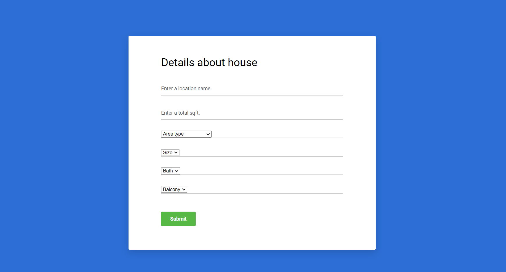

# Home_price_prediction
## [Machine_Learning_With_Flask]

&nbsp;
&nbsp;
&nbsp; 
&nbsp; 
&nbsp;

# [Deploy_with_Heroku]() ⭐

This data science project series walks through step by step process of how to build a [REAL ESTATE PRICE PREDICTION] website. We will first build a model using sklearn and linear regression using banglore home prices dataset from kaggle.com. Second step would be to write a python flask server that uses the saved model to serve http requests. Third component is the website built in html that allows user to enter home square ft area, bedrooms etc and it will call python flask server to retrieve the predicted price. During model building we will cover almost all data science concepts such as data load and cleaning, outlier detection and removal, feature engineering, dimensionality reduction, gridsearchcv for hyperparameter tunning, k fold cross validation etc. Technology and tools wise this project covers,

# [Web Application Link]() ⭐

https://banglore-house-price.herokuapp.com/

